# Seele Video Skills

Open video-production skills and reusable workflows for **Film & CG** creators in [Seele Workspace](https://www.seeles.ai/workspace?category=film-cg).

## Explore in Seele

- [Film & CG — Seele Workspace](https://www.seeles.ai/workspace?category=film-cg)
- [Greybox Previz](https://www.seeles.ai/features/create/greybox-previz)
- [3D Director](https://www.seeles.ai/features/tools/3d-director)

## Current Film & CG skill collection

The production Film & CG feed currently contains 12 entries. Each image below is the corresponding live Workspace Card cover, archived here as a stable case preview.

| Case preview | Skill / workflow | Card ID | What it does |
| --- | --- | --- | --- |
| 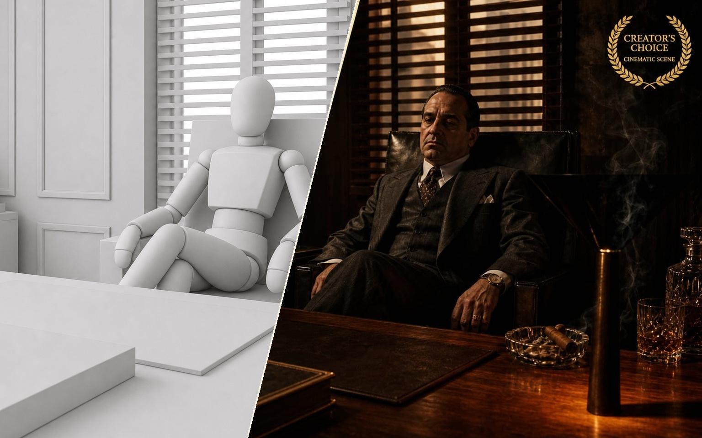 | [Greybox Previz](skills/greybox-cg-v2v/) | `greybox-previz` | Builds fast 3D greybox previews for shot planning and iteration. |
| 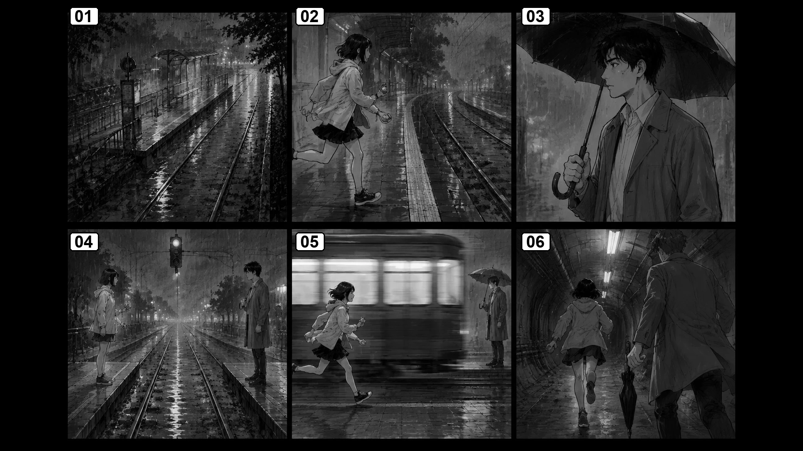 | [Comic Storyboard](skills/script-to-comic-storyboard/) | `script-to-comic-storyboard` | Turns a story or script into a structured, shootable storyboard. |
| 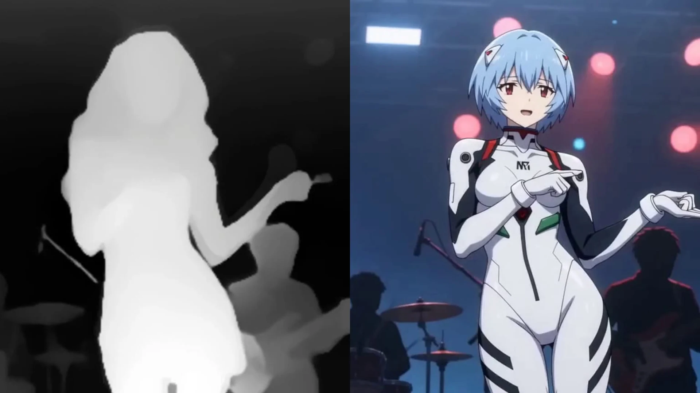 | [Depth-Guided Motion Transfer](skills/convert-video-to-depth-spatial/) | `depth-guided-motion-transfer` | Transfers motion with depth guidance for stronger spatial consistency. |
| 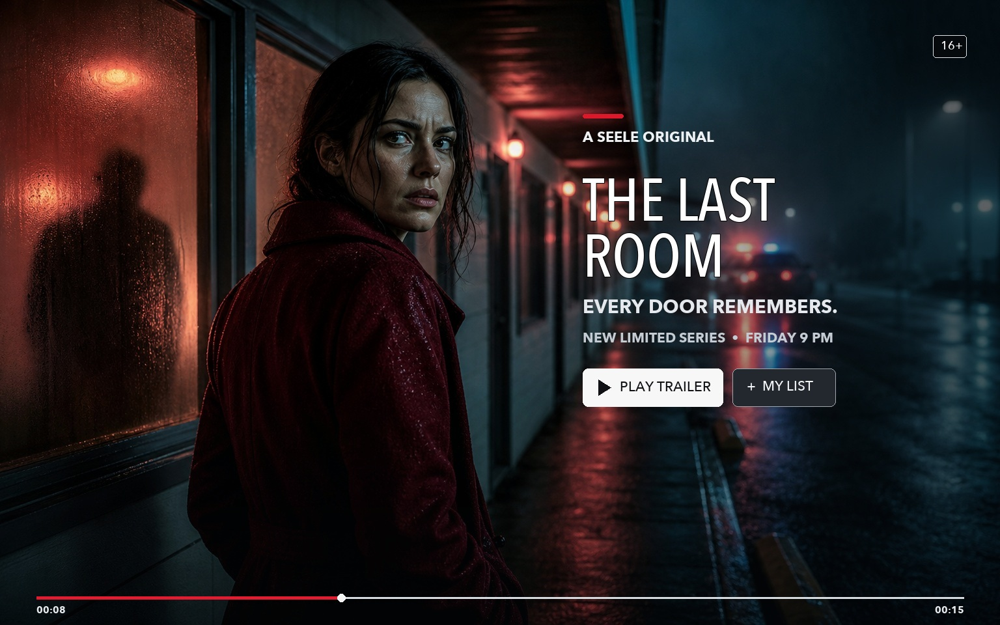 | [Promo Video](skills/promo-video-generator/) | `promo-video-generator` | Creates concise promotional video assets. |
| 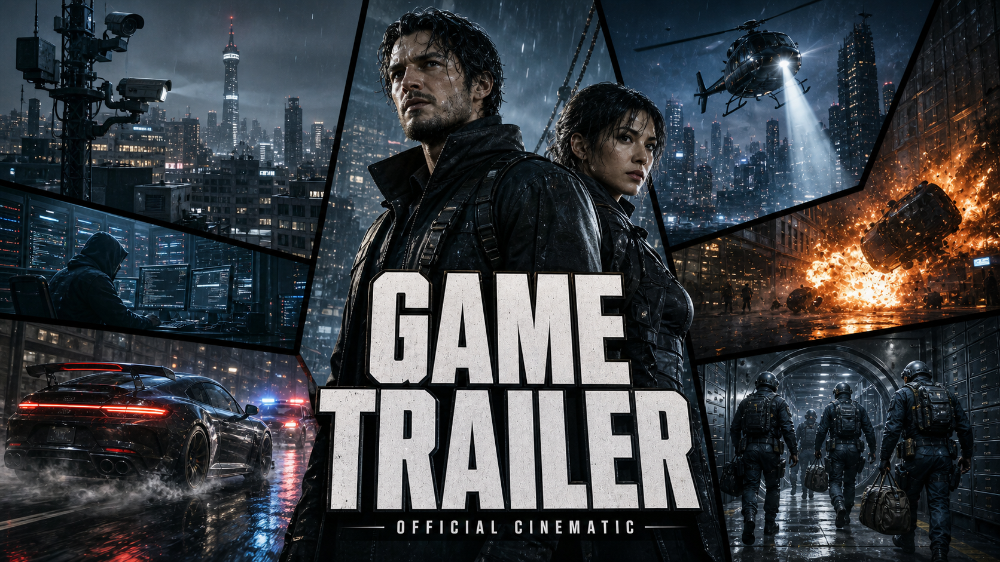 | [Game Trailer](skills/game-trailer/) | `game-trailer` | Produces trailer concepts and edits for games. |
| 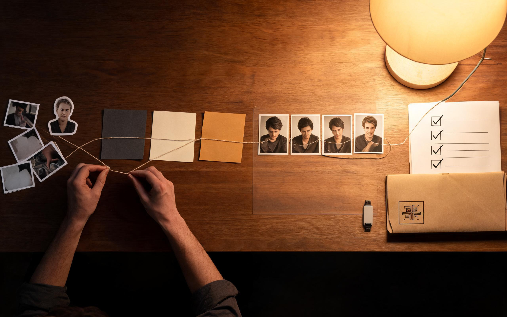 | [Brand Story Video](skills/brand-story-video/) | `brand-story-video` | Develops brand narratives into cinematic video structures. |
| 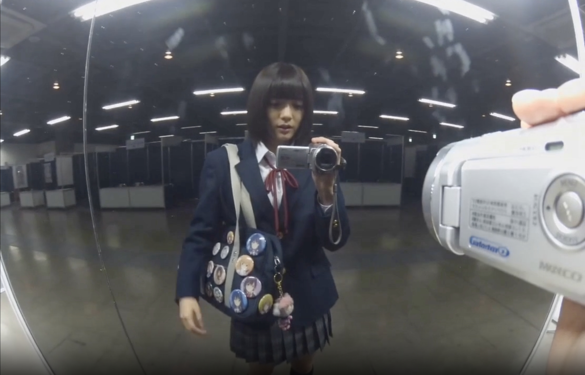 | [Authentic Camcorder Vlog](skills/authentic-camcorder-vlog-video-prompts/) | `authentic-camcorder-vlog` | Creates handheld, lived-in camcorder-style vlog videos. |
| 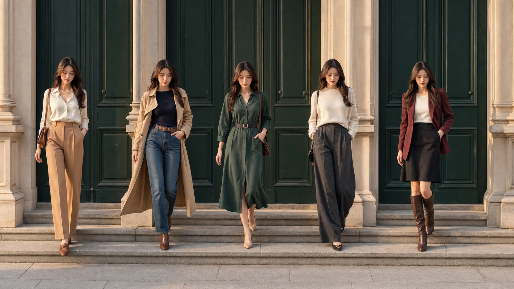 | [Weekly Outfit Transitions](skills/weekly-outfit-transition-video-prompts/) | `weekly-outfit-transitions` | Produces structured weekly outfit-change transition videos. |
| 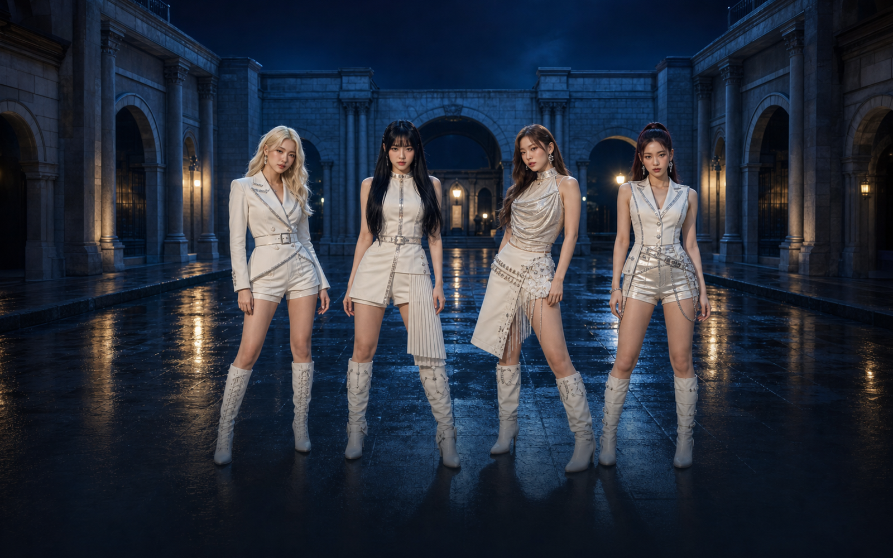 | [K-POP One-Take Reveal](skills/kpop-multi-character-one-take-video-generator/) | `kpop-one-take-reveal` | Creates multi-character K-POP reveal videos as one continuous shot. |
| 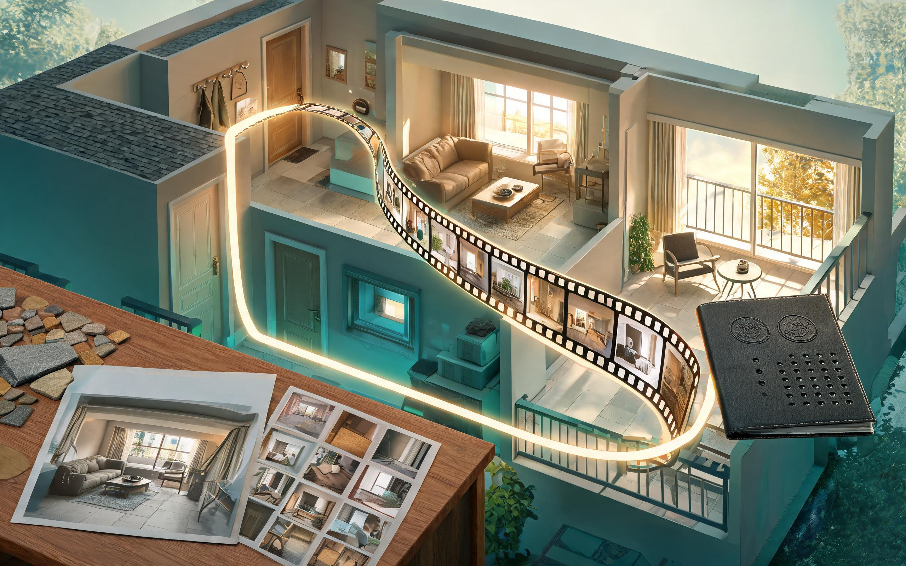 | [Real Estate Video](skills/real-estate-video/) | `real-estate-video` | Produces property-focused cinematic marketing videos. |
|  | [AI Video Generator](skills/ai-video-generator/) | `video-generation` | Generates videos from creative prompts and references. |
| 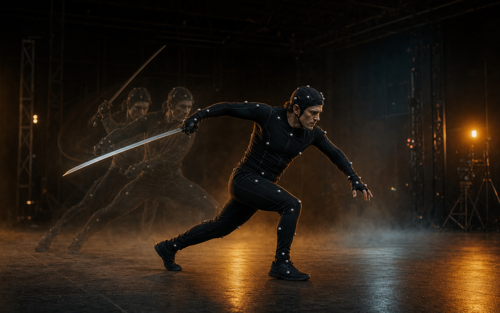 | [Motion Generation](skills/motion-generation/) | `motion-generation` | Generates and explores character or scene motion. |

Inventory and cover sources were verified against the public production Workspace feed on **2026-07-30**. Original source URLs and SHA-256 checksums are recorded in [`assets/cases/sources.json`](assets/cases/sources.json).

> This repository is the public sharing home for Seele's video skills. Skill packages will be added progressively after documentation, dependency, asset-rights, and security review.

## Repository structure

```text
skills/       # Reusable skill packages
examples/     # Example inputs and expected outputs
docs/         # Guides and integration notes
```

## Contributing

Contributions are welcome. Please open an issue describing the workflow, supported inputs/outputs, external dependencies, model requirements, and asset/license provenance before submitting a pull request.

Do not commit API keys, private endpoints, proprietary model weights, or assets without redistribution rights.

## License

Released under the [MIT License](LICENSE), unless a skill directory states otherwise. Third-party models and assets remain subject to their own licenses.
